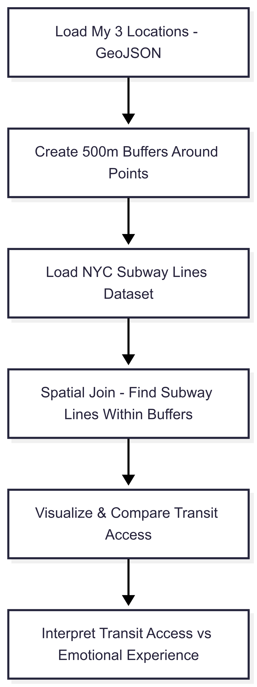

# Three Stops on My NYC Timeline (2022–2025)

*Assignment: Geoprocessing project mapping a personal NYC narrative and relating it to subway lines.*

This project maps my three major living locations in NYC: Lincoln Center, Fordham Rose Hill campus in the Bronx, and W 100th St. Each is annotated with emotional reflections and time periods to create a personal geography.

## Dataset: `three_stops.geojson`

- Type: Point data (3 features)  
- Attributes: location, period, mood, note

## Related Dataset: NYC Subway Lines

- Source: [2016 (May) New York City Subway Routes](https://geo.nyu.edu/catalog/nyu-2451-34758)  
- File included: `nyu-2451-34758-geojson.json`

This dataset will be used to analyze proximity to subway lines for each location.

## Methodology Overview

1. Load both datasets into QGIS or similar GIS tool.  
2. Create a 500m buffer around each location in `three_stops.geojson`.  
3. Perform a spatial join with subway lines dataset.  
4. Analyze which lines intersect and what that implies about mobility/access.  
5. Reflect on emotional significance per site in relation to transit access.

## Spatial Workflow Diagram

Below is the workflow diagram illustrating the spatial analysis process:

